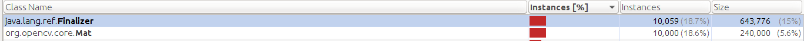
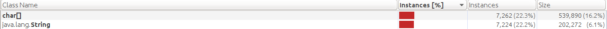
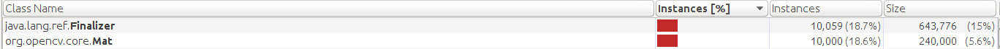
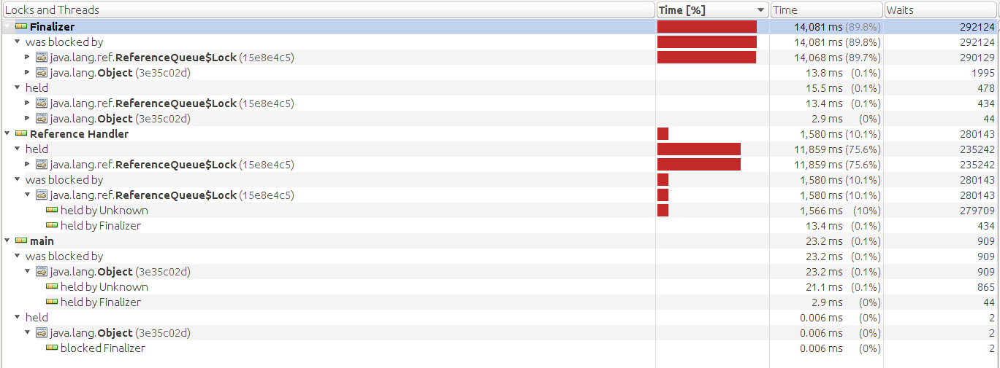
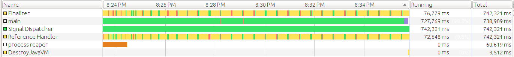
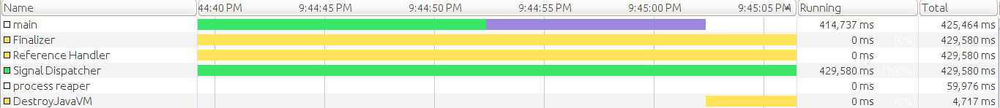

## OpenCV Java memory management

This is a NetBeans 8 Java project that demonstrates various memory concerns with
the OpenCV Java bindings. I used NetBeans because of its excellent profiler.

My Ubuntu install script [install-opencv](https://github.com/sgjava/install-opencv)
patches the OpenCV source to prevent the problems described herein. If you are
using Ubuntu this will save you a lot of time instead of manually patching.

### Prerequisites

This is only necessary if you wish to experiment yourself. If you just want to
learn how OpenCV Java memory management works skip the items below.

* Java is installed (I used Oracle JDK 8, Ubuntu, X86_64)
* Ant is installed (for OpenCV build)
* You need to install OpenCV's dependencies and build it. I used master branch
which is currently 3.0.0:
  `git clone https://github.com/Itseez/opencv.git`
* Install Valgrind and the Valkyrie GUI `sudo apt-get install valgrind valkyrie`
* NetBeans 8 was used, but you can compile the source however you wish

### The current way to free native memory

OpenCV 2.4 and 3.0 use a Python code generator
`modules/java/generator/gen_java.py` to generate Java bindings during the build
process. The generated code to free native resources looks like:

```
@Override
protected void finalize() throws Throwable {
    delete(nativeObj);
}
```

Mat `modules/core/misc/java/src/java/core+Mat.java` uses something similar
(Mat.release() frees the numerical matrix and allows reuse):

```
public void release()
{

    n_release(nativeObj);

    return;
}

@Override
protected void finalize() throws Throwable {
    n_delete(nativeObj);
    super.finalize();
}
```

It is generally considered bad practice to use finalize since there is no
guarantee if or when it will be called. When you build applications that process
a lot of new Mats you will end up with a lot of finalizers in the Finalizer
queue and it eventually will get backed up. Another side effect that is
demonstrated by new Mat() is that it will consume large amounts of native memory
since n_release and n_delete are never called. For more reading on the finalize()
subject see:

* [Debugging to understand Finalizers](https://plumbr.eu/blog/garbage-collection/debugging-to-understand-finalizer)
* [Why would you ever implement finalize()?](http://stackoverflow.com/questions/158174/why-would-you-ever-implement-finalize)

"Moral of the story? Next time, when you consider finalize() to be superior to
the usual cleanup, teardown or finally blocks, think again. You might be happy
with the clean code you produced, but the ever-growing queue of Finalizable
objects thrashing your tenured and old generations might indicate the need to
reconsider."

#### Profiling OpenCVNewMat program

Using Netbeans I profiled [OpenCVNewMat.java](https://github.com/sgjava/opencvmem/blob/master/src/com/codeferm/opencv/OpenCVNewMat.java)
without explicit garbage collection:



Note that all 10000 Mat objects are still allocated on the heap with 10000+
Finalizers when the program exists. Total JVM memory used was 62M. If I run the
program without creating any Mat objects only 22M is used. To inspect native
memory usage I will use Valgrind:

```
valgrind --trace-children=yes --leak-check=full --num-callers=20 --smc-check=all --xml=yes --xml-file=/home/<username>/opencv.xml java -Djava.compiler=NONE -Djava.library.path=/home/<username>/opencv/build/lib -cp build/classes/.:/home/<username>/opencv/build/bin/opencv-300.jar com.codeferm.opencv.OpenCVNewMat
```

```
LPL [1]: 9,215,318,376 bytes in 9,999 blocks are possibly lost in loss record 1,271 of 1,271
   Thread Id: 1
   9,215,318,376 bytes in 9,999 blocks are possibly lost in loss record 1,271 of 1,271
   stack
      0x4C2AB80: malloc (in /usr/lib/valgrind/vgpreload_memcheck-amd64-linux.so)
      0x1ED857C1: cv::fastMalloc(unsigned long) (in /home/<username>/opencv/build/lib/libopencv_core.so.3.0.0)
      0x1EED8A4C: cv::StdMatAllocator::allocate(int, int const*, int, void*, unsigned long*, int, cv::UMatUsageFlags) const (in /home/<username>/opencv/build/lib/libopencv_core.so.3.0.0)
      0x1EEDBC0D: cv::Mat::create(int, int const*, int) (in /home/<username>/opencv/build/lib/libopencv_core.so.3.0.0)
      0x1EA27EE0: Java_org_opencv_core_Mat_n_1Mat(intXX_t) (in /home/<username>/opencv/build/lib/libopencv_java300.so)
```

Wow, 8.5G of native memory used! As you can see finalize() was not called even
though all 10000 Mat objects were no longer referenced and available to be
garbage collected.

Now I will add the 'gc' command line argument forcing a `System.gc()`:



You will note that the finalize() method was called this time since there are
no Mat objects present. To be safe we still check with Valgrind (note the gc
parameter was passed):

```
valgrind --trace-children=yes --leak-check=full --num-callers=20 --smc-check=all --xml=yes --xml-file=/home/<username>/opencv.xml java -Djava.compiler=NONE -Djava.library.path=/home/<username>/opencv/build/lib -cp build/classes/.:/home/<username>/opencv/build/bin/opencv-300.jar com.codeferm.opencv.OpenCVNewMat gc
```

No native leaks from Mat either, so one would think it is OK to call `System.gc()`
periodically, right? Well this is considered a bad practice as well. [Why is it bad practice to call System.gc()?](http://stackoverflow.com/questions/2414105/why-is-it-bad-practice-to-call-system-gc)
One of the answers summarizes it well "The reason everyone always says to avoid
`System.gc()` is that it is a pretty good indicator of fundamentally broken code.
Any code that depends on it for correctness is certainly broken; any that rely
on it for performance are most likely broken." One important factor to remember
is that different JVM implementations (and versions) behave differently. Some
JVMs may choose to ignore the `System.gc()` hint altogether.

You will see `System.gc()` recommended in this thread
[Memory Leak from iterating Opencv frames](http://stackoverflow.com/questions/21050499/memory-leak-from-iterating-opencv-frames).
If you are cool with that then you should probably stop reading now. If you want
to learn more then read on.

#### What about Mat.release()?

If you do not want to use the `System.gc()` method it is recommended you call
Mat.release() in order to free native memory. The code for Mat.release() looks
like:

```
// javadoc: Mat::release()
public void release()
{

    n_release(nativeObj);

    return;
}
```

#### Profiling OpenCVRelease program

Using Netbeans I profiled [OpenCVRelease.java](https://github.com/sgjava/opencvmem/blob/master/src/com/codeferm/opencv/OpenCVRelease.java)
without explicit garbage collection:



Note that all 10000 Mat objects are still allocated on the heap with 10000+
Finalizers when the program exists. Calling Mat.release() did not garbage
collect any of the Mat objects again. To inspect native memory usage I will use
Valgrind:

```
valgrind --trace-children=yes --leak-check=full --num-callers=20 --smc-check=all --xml=yes --xml-file=/home/<username>/opencv.xml java -Djava.compiler=NONE -Djava.library.path=/home/<username>/opencv/build/lib -cp build/classes/.:/home/<username>/opencv/build/bin/opencv-300.jar com.codeferm.opencv.OpenCVRelease
```

No native leaks from Mat, but Mat objects and Finalizers are leaking on the
heap. What happens if we go from 10,000 to say 1,000,000.


Now ~937K Mat objects and Finalizsers are allocated on the heap. This is not
good, but it could be worse. How about the Finalizer thread backing up and
slowing the JVM down. This time we will profile threads and lock contention:



Using 100 million Mats we can see that there are lock contentions with the
Finalizer, Reference Handler and main threads. To look at in context of a 12.37
minute runtime, the Finalizer thread used 76 seconds and the Reference Handler
used 72 seconds.



This may not seem like a big deal, but eventually performance and object leaks
will have an impact on long running processes. I have code that processes 10+
frames a second 24x7x365. It does not take a rocket scientist to figure out
where this will end up (I know because I have been there).

Hopefully at this point you realize that Object.finalize() is evil because it
causes unreferenced objects to live longer and uses extra processing cleaning
up.

### Tricks of the trade

If you want to use the OpenCV bindings as is there are some tricks you can
utilize to reduce the behaviors described above.

#### Reuse Mat

In some applications it is best to reuse a Mat when rows, columns and type are
the same. One scenario would involve reading a sequence of frames for
processing. You may only need the Mat for some cumulative process and can
overwrite it for the next frame:

```
final Mat mat = new Mat();
while (videoCapture.read(mat)) {
	videoWriter.write(mat);
}
mat.release();
```

#### Pool Mat

It is beyond the scope of this project to give you an example of pooling, but I
will describe the basic concept. The pattern consists of acquire and recycle
methods that borrow (creating a Mat if necessary) and return a Mat to the pool.
This allows you to work with a lot of different Mats and not worry about
creating them unnecessarily. I built a pool class that requires rows, columns
and type, so you can pool multiple types and resolutions. This also saves you
from constantly thrashing native memory (allocation/deallocation) by creating
and releasing Mats.

You have to treat the pool like any other pool (DataSource comes to mind) and
recycle or you will end up leaking resources.

### Beyond the Mat

Other classes in OpenCV have the finalize issue as well. Here is a list:

```
./org/opencv/video/KalmanFilter.java
./org/opencv/video/BackgroundSubtractorMOG2.java
./org/opencv/video/BackgroundSubtractor.java
./org/opencv/video/DenseOpticalFlow.java
./org/opencv/video/BackgroundSubtractorKNN.java
./org/opencv/video/DualTVL1OpticalFlow.java
./org/opencv/core/Algorithm.java
./org/opencv/calib3d/StereoMatcher.java
./org/opencv/calib3d/StereoBM.java
./org/opencv/calib3d/StereoSGBM.java
./org/opencv/features2d/FeatureDetector.java
./org/opencv/features2d/DescriptorMatcher.java
./org/opencv/features2d/DescriptorExtractor.java
./org/opencv/videoio/VideoCapture.java
./org/opencv/videoio/VideoWriter.java
./org/opencv/ml/StatModel.java
./org/opencv/ml/LogisticRegression.java
./org/opencv/ml/Boost.java
./org/opencv/ml/ANN_MLP.java
./org/opencv/ml/RTrees.java
./org/opencv/ml/DTrees.java
./org/opencv/ml/TrainData.java
./org/opencv/ml/SVM.java
./org/opencv/ml/KNearest.java
./org/opencv/ml/EM.java
./org/opencv/ml/NormalBayesClassifier.java
./org/opencv/imgproc/Subdiv2D.java
./org/opencv/imgproc/CLAHE.java
./org/opencv/imgproc/LineSegmentDetector.java
./org/opencv/objdetect/CascadeClassifier.java
./org/opencv/objdetect/HOGDescriptor.java
./org/opencv/objdetect/BaseCascadeClassifier.java
./org/opencv/photo/TonemapDrago.java
./org/opencv/photo/CalibrateRobertson.java
./org/opencv/photo/CalibrateCRF.java
./org/opencv/photo/CalibrateDebevec.java
./org/opencv/photo/Tonemap.java
./org/opencv/photo/AlignMTB.java
./org/opencv/photo/MergeDebevec.java
./org/opencv/photo/MergeExposures.java
./org/opencv/photo/MergeMertens.java
./org/opencv/photo/MergeRobertson.java
./org/opencv/photo/TonemapReinhard.java
./org/opencv/photo/TonemapDurand.java
./org/opencv/photo/TonemapMantiuk.java
./org/opencv/photo/AlignExposures.java
```

### How to fix the code

If you made it this far and want to fix the issues I have described above then
read on. It requires you to modify the OpenCV source, but the changes are minor.
You are probably asking yourself why I did not submit a pull request to OpenCV.
Well I did, but they were rejected. The beauty of Open Source is I'm not forced
to do things incorrectly.

* [Opencv sgjava](https://github.com/Itseez/opencv/pull/4014)
* [New Java memory mgt doc](https://github.com/Itseez/opencv/pull/4019)
* [Added finalize back in](https://github.com/Itseez/opencv/pull/4029)

#### Fix the Python code generator

* Edit `modules/java/generator/gen_java.py`
* Find
```
@Override
protected void finalize() throws Throwable {
    delete(nativeObj);
}
```
* Change to
```
public void free() {
    if (nativeObj != 0) {
        delete(nativeObj);
        nativeObj = 0;
    }
}
```
* Find
```
protected final long nativeObj;
```
* Change to
```
protected long nativeObj;
```

This will create a free() method that replaces finalize(), thus you must make
sure you call free() when you are done with the various Objects in the list
above. I also removed the final modifier from nativeObj in order to set it to 0
once free() is called. This will prevent a JVM crash if delete() is called more
than once.

The free() method is not thread safe, but this should not be a big deal in most
situations. Just keep this in mind and use Synchronized if you run into
multi-threaded situations.

#### Fix Mat
* Edit `modules/core/misc/java/src/java/core+Mat.java`
* Find
```
@Override
protected void finalize() throws Throwable {
    n_delete(nativeObj);
    super.finalize();
}
```
* Change to
```
public void free() {
    if (nativeObj != 0) {
        release();
        n_delete(nativeObj);
        nativeObj = 0;
    }
}
```
* Find
```
public final long nativeObj;
```
* Change to
```
public long nativeObj;
```
* Change to your opencv build directory
* `make -j$(getconf _NPROCESSORS_ONLN)`

This will create a free() method that replaces finalize() thus you must make
sure you call free() when you are done with the Mat. I also removed the final
modifier from nativeObj in order to set it to 0 once free() is called. This will
prevent a JVM crash if delete() is called more than once. You can still use
Mat.release() to reuse the mat if you wish.

Also note how Mat.nativeObj is defined as a public when it should have been
private with an accessor method. This is improper encapsulation (subclasses
should use accessor method instead of a public variable), but I tried
to make my changes minimal.

Finally, the free() method is not thread safe, but this should not be a big
deal in most situations. Just keep this in mind and use Synchronized if you
run into multi-threaded situations.

#### Profiling OpenCVFree program

Using Netbeans I profiled [OpenCVFree.java](https://github.com/sgjava/opencvmem/blob/master/src/com/codeferm/opencv/OpenCVFree.java)
without explicit garbage collection:


This time there are no Mats on the heap! Sweet, this is what you want! To inspect
native memory usage I will use Valgrind:

```
valgrind --trace-children=yes --leak-check=full --num-callers=20 --smc-check=all --xml=yes --xml-file=/home/<username>/opencv.xml java -Djava.compiler=NONE -Djava.library.path=/home/<username>/opencv/build/lib -cp build/classes/.:/home/<username>/opencv/build/bin/opencv-300.jar com.codeferm.opencv.OpenCVFree
```

No native leaks from Mat either! Predictable behavior can now be expected from
Mat. For fun I will run OpenCVFree with 100 million Mats and profile threads
and lock contention:


Using 100 million Mats we can see that there are no lock contentions! It only
took 6.9 seconds using free() to process versus 12.37 seconds using finalize().
Hopefully you will see I am not making a big deal out of nothing by looking
at the evidence.



### More memory leaks lurking

Maybe at this point you might think you are out of the woods. Our friend
Valgrind will prove there are other memory leaks lurking in the OpenCV Java
bindings. Since I first stumbled upon memory issues with the OpenCV Java
bindings I always check my code with Valgrind to make sure I did not miss
anything. Here is what I have found to date.

The pull requests below add Mat.release() are based on the issues I reported
below, but the code still relies on finalize(). This will result in Mat objects
leaking and a small amount of native memory since n_delete is not called.

* [OpenCV pull request 4056 for master](https://github.com/Itseez/opencv/pull/4056)
* [OpenCV pull request 4057 for 2.4](https://github.com/Itseez/opencv/pull/4056)

#### Imgproc.findContours

Using Valgrind I profiled [OpenCVFindContours.java](https://github.com/sgjava/opencvmem/blob/master/src/com/codeferm/opencv/OpenCVFindContours.java)
without explicit garbage collection:

```
valgrind --trace-children=yes --leak-check=full --num-callers=20 --smc-check=all --xml=yes --xml-file=/home/<username>/opencv.xml java -Djava.compiler=NONE -Djava.library.path=/home/<username>/opencv/build/lib -cp build/classes/.:/home/<username>/opencv/build/bin/opencv-300.jar com.codeferm.opencv.OpenCVFindContours
```

```
LPL [1]: 17,600 bytes in 200 blocks are possibly lost in loss record 1,290 of 1,320
   Thread Id: 1
   17,600 bytes in 200 blocks are possibly lost in loss record 1,290 of 1,320
   stack
      0x4C2AB80: malloc (in /usr/lib/valgrind/vgpreload_memcheck-amd64-linux.so)
      0x1ED857C1: cv::fastMalloc(unsigned long) (in /home/<username>/opencv/build/lib/libopencv_core.so.3.0.0)
      0x1EED8A4C: cv::StdMatAllocator::allocate(int, int const*, int, void*, unsigned long*, int, cv::UMatUsageFlags) const (in /home/<username>/opencv/build/lib/libopencv_core.so.3.0.0)
      0x1EEDBC0D: cv::Mat::create(int, int const*, int) (in /home/<username>/opencv/build/lib/libopencv_core.so.3.0.0)
      0x1EF06D5F: cv::_OutputArray::create(int, int, int, int, bool, int) const (in /home/<username>/opencv/build/lib/libopencv_core.so.3.0.0)
      0x1EF7458D: cv::Mat::copyTo(cv::_OutputArray const&) const (in /home/<username>/opencv/build/lib/libopencv_core.so.3.0.0)
      0x1EA1EFD0: vector_Point_to_Mat(std::vector<cv::Point_<int>, std::allocator<cv::Point_<int> > >&, cv::Mat&) (in /home/<username>/opencv/build/lib/libopencv_java300.so)
      0x1EA240FB: vector_vector_Point_to_Mat(std::vector<std::vector<cv::Point_<int>, std::allocator<cv::Point_<int> > >, std::allocator<std::vector<cv::Point_<int>, std::allocator<cv::Point_<int> > > > >&, cv::Mat&) (in /home/<username>/opencv/build/lib/libopencv_java300.so)
      0x1EA4D49B: Java_org_opencv_imgproc_Imgproc_findContours_11 (in /home/<username>/opencv/build/lib/libopencv_java300.so)
```

Imgproc.findContours has a memory leak because it creates a local Mat and does
not release it!. Note how there are 200 leaks in the first section above, but
cv::findContours is also loosing a block. The code for findContours looks like:

```
//javadoc: findContours(image, contours, hierarchy, mode, method, offset)
public static void findContours(Mat image, List<MatOfPoint> contours, Mat hierarchy, int mode, int method, Point offset)
{
    Mat contours_mat = new Mat();
    findContours_0(image.nativeObj, contours_mat.nativeObj, hierarchy.nativeObj, mode, method, offset.x, offset.y);
    Converters.Mat_to_vector_vector_Point(contours_mat, contours);
    return;
}

//javadoc: findContours(image, contours, hierarchy, mode, method)
public static void findContours(Mat image, List<MatOfPoint> contours, Mat hierarchy, int mode, int method)
{
    Mat contours_mat = new Mat();
    findContours_1(image.nativeObj, contours_mat.nativeObj, hierarchy.nativeObj, mode, method);
    Converters.Mat_to_vector_vector_Point(contours_mat, contours);
    return;
}
```

Note how contours_mat is not released the "normal" OpenCV way. No problem since
we can fix this too. It is a simple matter of adding contours_mat.free(). If you
are using the unmodified Mat class then you can do contours_mat.release(), but
you will still be leaking Mat objects.

#### Fix Imgproc.findContours
* Edit `build/src/org/opencv/imgproc/Imgproc.java`
* Find
```
public static void findContours(Mat image, List<MatOfPoint> contours, Mat hierarchy, int mode, int method, Point offset)
{
    Mat contours_mat = new Mat();
    findContours_0(image.nativeObj, contours_mat.nativeObj, hierarchy.nativeObj, mode, method, offset.x, offset.y);
    Converters.Mat_to_vector_vector_Point(contours_mat, contours);
    return;
}

//javadoc: findContours(image, contours, hierarchy, mode, method)
public static void findContours(Mat image, List<MatOfPoint> contours, Mat hierarchy, int mode, int method)
{
    Mat contours_mat = new Mat();
    findContours_1(image.nativeObj, contours_mat.nativeObj, hierarchy.nativeObj, mode, method);
    Converters.Mat_to_vector_vector_Point(contours_mat, contours);
    return;
}
```
* Change to
```
public static void findContours(Mat image, List<MatOfPoint> contours, Mat hierarchy, int mode, int method, Point offset)
{
    Mat contours_mat = new Mat();
    findContours_0(image.nativeObj, contours_mat.nativeObj, hierarchy.nativeObj, mode, method, offset.x, offset.y);
    Converters.Mat_to_vector_vector_Point(contours_mat, contours);
    contours_mat.free();
    return;
}

//javadoc: findContours(image, contours, hierarchy, mode, method)
public static void findContours(Mat image, List<MatOfPoint> contours, Mat hierarchy, int mode, int method)
{
    Mat contours_mat = new Mat();
    findContours_1(image.nativeObj, contours_mat.nativeObj, hierarchy.nativeObj, mode, method);
    Converters.Mat_to_vector_vector_Point(contours_mat, contours);
    contours_mat.free();
    return;
}
```

#### Converters

Converters.Mat_to_vector_vector_Point2f and Converters.Mat_to_vector_vector_Point3f
have a memory leak because they create local Mats and do not release them!. The
code for Converters looks like:

```
public static void Mat_to_vector_vector_Point(Mat m, List<MatOfPoint> pts) {
    if (pts == null)
        throw new java.lang.IllegalArgumentException("Output List can't be null");

    if (m == null)
        throw new java.lang.IllegalArgumentException("Input Mat can't be null");

    List<Mat> mats = new ArrayList<Mat>(m.rows());
    Mat_to_vector_Mat(m, mats);
    for (Mat mi : mats) {
        MatOfPoint pt = new MatOfPoint(mi);
        pts.add(pt);
    }
}

// vector_vector_Point2f
public static void Mat_to_vector_vector_Point2f(Mat m, List<MatOfPoint2f> pts) {
    if (pts == null)
        throw new java.lang.IllegalArgumentException("Output List can't be null");

    if (m == null)
        throw new java.lang.IllegalArgumentException("Input Mat can't be null");

    List<Mat> mats = new ArrayList<Mat>(m.rows());
    Mat_to_vector_Mat(m, mats);
    for (Mat mi : mats) {
        MatOfPoint2f pt = new MatOfPoint2f(mi);
        pts.add(pt);
    }
}

// vector_vector_Point3f
public static void Mat_to_vector_vector_Point3f(Mat m, List<MatOfPoint3f> pts) {
    if (pts == null)
        throw new java.lang.IllegalArgumentException("Output List can't be null");

    if (m == null)
        throw new java.lang.IllegalArgumentException("Input Mat can't be null");

    List<Mat> mats = new ArrayList<Mat>(m.rows());
    Mat_to_vector_Mat(m, mats);
    for (Mat mi : mats) {
        MatOfPoint3f pt = new MatOfPoint3f(mi);
        pts.add(pt);
    }
}
```

Note how mi is not released the "normal" OpenCV way. No problem since we can fix
this too. It is a simple matter of adding mi.free(). If you are using the
unmodified Mat class then you can do mi.release(), but you will still be leaking
Mat objects.

#### Fix Converters
* Edit `build/src/org/opencv/utils/Converters.java`
* Find
```
public static void Mat_to_vector_vector_Point(Mat m, List<MatOfPoint> pts) {
    if (pts == null)
        throw new java.lang.IllegalArgumentException("Output List can't be null");

    if (m == null)
        throw new java.lang.IllegalArgumentException("Input Mat can't be null");

    List<Mat> mats = new ArrayList<Mat>(m.rows());
    Mat_to_vector_Mat(m, mats);
    for (Mat mi : mats) {
        MatOfPoint pt = new MatOfPoint(mi);
        pts.add(pt);
    }
}

// vector_vector_Point2f
public static void Mat_to_vector_vector_Point2f(Mat m, List<MatOfPoint2f> pts) {
    if (pts == null)
        throw new java.lang.IllegalArgumentException("Output List can't be null");

    if (m == null)
        throw new java.lang.IllegalArgumentException("Input Mat can't be null");

    List<Mat> mats = new ArrayList<Mat>(m.rows());
    Mat_to_vector_Mat(m, mats);
    for (Mat mi : mats) {
        MatOfPoint2f pt = new MatOfPoint2f(mi);
        pts.add(pt);
    }
}

// vector_vector_Point3f
public static void Mat_to_vector_vector_Point3f(Mat m, List<MatOfPoint3f> pts) {
    if (pts == null)
        throw new java.lang.IllegalArgumentException("Output List can't be null");

    if (m == null)
        throw new java.lang.IllegalArgumentException("Input Mat can't be null");

    List<Mat> mats = new ArrayList<Mat>(m.rows());
    Mat_to_vector_Mat(m, mats);
    for (Mat mi : mats) {
        MatOfPoint3f pt = new MatOfPoint3f(mi);
        pts.add(pt);
    }
}
```
* Change to
```
public static void Mat_to_vector_vector_Point(Mat m, List<MatOfPoint> pts) {
    if (pts == null)
        throw new java.lang.IllegalArgumentException("Output List can't be null");

    if (m == null)
        throw new java.lang.IllegalArgumentException("Input Mat can't be null");

    List<Mat> mats = new ArrayList<Mat>(m.rows());
    Mat_to_vector_Mat(m, mats);
    for (Mat mi : mats) {
        MatOfPoint pt = new MatOfPoint(mi);
        pts.add(pt);
        mi.free();
    }
}

// vector_vector_Point2f
public static void Mat_to_vector_vector_Point2f(Mat m, List<MatOfPoint2f> pts) {
    if (pts == null)
        throw new java.lang.IllegalArgumentException("Output List can't be null");

    if (m == null)
        throw new java.lang.IllegalArgumentException("Input Mat can't be null");

    List<Mat> mats = new ArrayList<Mat>(m.rows());
    Mat_to_vector_Mat(m, mats);
    for (Mat mi : mats) {
        MatOfPoint2f pt = new MatOfPoint2f(mi);
        pts.add(pt);
        mi.free();
    }
}

// vector_vector_Point3f
public static void Mat_to_vector_vector_Point3f(Mat m, List<MatOfPoint3f> pts) {
    if (pts == null)
        throw new java.lang.IllegalArgumentException("Output List can't be null");

    if (m == null)
        throw new java.lang.IllegalArgumentException("Input Mat can't be null");

    List<Mat> mats = new ArrayList<Mat>(m.rows());
    Mat_to_vector_Mat(m, mats);
    for (Mat mi : mats) {
        MatOfPoint3f pt = new MatOfPoint3f(mi);
        pts.add(pt);
        mi.free();
    }
}
```

Now when I profile I see only one leak, but it is down in the C++ code
cv::findContours. This should not be a big deal because it does not grow based
on the number of calls.

```
LDL [1]: 32,816 bytes in 1 blocks are definitely lost in loss record 1,318 of 1,333
   Thread Id: 1
   32,816 bytes in 1 blocks are definitely lost in loss record 1,318 of 1,333
   stack
      0x1EF2D557: (anonymous namespace)::opencl_fn3<58, int, unsigned int, _cl_platform_id**, unsigned int*>::switch_fn(unsigned int, _cl_platform_id**, unsigned int*) (in /home/<username>/opencv/build/lib/libopencv_core.so.3.0.0)
0x1EDA9542: cv::ocl::haveOpenCL() (in /home/<username>/opencv/build/lib/libopencv_core.so.3.0.0)
0x1EDB53C4: cv::ocl::useOpenCL() (in /home/<username>/opencv/build/lib/libopencv_core.so.3.0.0)
0x1FA868DB: cv::threshold(cv::_InputArray const&, cv::_OutputArray const&, double, double, int) (in /home/<username>/opencv/build/lib/libopencv_imgproc.so.3.0.0)
0x1FA89F3D: cvThreshold (in /home/<username>/opencv/build/lib/libopencv_imgproc.so.3.0.0)
0x1FA2B782: cvStartFindContours (in /home/<username>/opencv/build/lib/libopencv_imgproc.so.3.0.0)
0x1FA2E036: cvFindContours (in /home/<username>/opencv/build/lib/libopencv_imgproc.so.3.0.0)
0x1FA2E494: cv::findContours(cv::_InputOutputArray const&, cv::_OutputArray const&, cv::_OutputArray const&, int, int, cv::Point_<int>) (in /home/<username>/opencv/build/lib/libopencv_imgproc.so.3.0.0)
```

### In summary
* Object.finalize() is evil as pointed out in various articles and the evidence
I provided. If you want unpredictable garbage collection, thread contention and
slower code then by all means use it.
* Having to rely on System.gc() for garbage collection indicates poorly
engineered code.
* NetBeans profiler and Valgrind are indispensable tools for finding memory
leaks and performance problems.